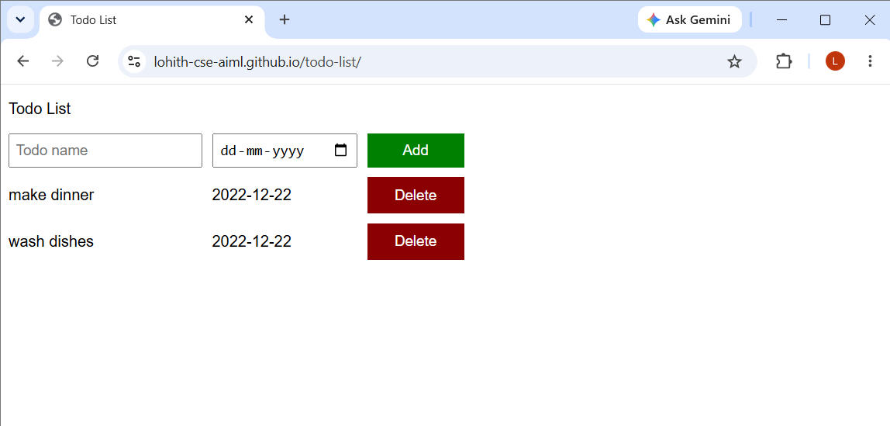

# 📝 To-Do List App

A simple To-Do List web application built using **HTML, CSS, and JavaScript**.

## 🚀 Features

* Add new tasks
* Delete tasks
* Mark tasks as completed
* Simple and clean UI

## 🛠️ Technologies Used

* HTML
* CSS
* JavaScript (DOM Manipulation)
* Local Storage 

## 📸 Preview



## 📂 Project Structure

```
to-do-list/
│── to_do.html
│── todoList.css
│── to_do.js
│── screenshot_td.png 
│── README.md
```

## 🎯 Purpose

This project was built to practice JavaScript DOM manipulation and improve frontend development skills.

## 🔗 Live Demo

👉 https://lohith-cse-aiml.github.io/todo-list/

## 👨‍💻 Author

Lohith
